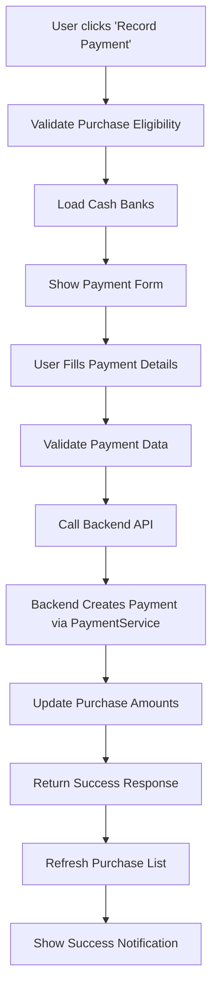

# Purchase Payment Management Integration

## 📋 Overview

This documentation describes the integration of Payment Management functionality into the Purchase Management system. The integration allows users to record payments for approved credit purchases directly from the Purchase Management interface, with payments automatically appearing in the central Payment Management system.

## 🎯 Features Implemented

### Backend Integration
- ✅ **New Payment Endpoint**: `/api/v1/purchases/:id/payments` (POST)
- ✅ **Direct Payment Management Integration**: Uses `paymentService.CreatePayablePayment()`
- ✅ **Automatic Bill Allocation**: Payments are automatically allocated to the specific purchase
- ✅ **Real-time Purchase Updates**: Purchase paid/outstanding amounts are updated immediately
- ✅ **Unified Payment Tracking**: All payments appear in both Purchase and Payment Management systems

### Frontend Integration
- ✅ **Record Payment Button**: Available for approved credit purchases with outstanding amounts
- ✅ **Payment Modal Form**: User-friendly form for payment details
- ✅ **Payment Method Validation**: Only CREDIT purchases can receive payments
- ✅ **Outstanding Amount Display**: Clear visualization of paid vs outstanding amounts
- ✅ **Payment Statistics**: Dashboard cards showing total paid and outstanding amounts
- ✅ **Enhanced Table Columns**: Added Paid, Outstanding, and Payment Method columns

## 🖥️ User Interface

### Purchase Management Dashboard
The dashboard now includes:
- **Total Paid Amount** card - Shows sum of all payments made
- **Outstanding Amount** card - Shows total amount still owed
- **Enhanced Purchase Table** with payment information columns

### Purchase Table Columns
| Column | Description |
|--------|-------------|
| Paid | Amount already paid (green if > 0) |
| Outstanding | Amount still owed (orange if > 0) |
| Payment | Payment method badge + "Can Pay" indicator |

### Record Payment Process
1. **Eligibility Check**: Only approved CREDIT purchases with outstanding amounts show the "Record Payment" button
2. **Payment Form**: Modal form with fields for:
   - Payment amount (validated against outstanding amount)
   - Payment date
   - Payment method (Bank Transfer, Cash, Check, Other)
   - Bank account selection
   - Reference and notes
3. **Success Confirmation**: Payment is recorded in both systems with success notification

## 🔐 Access Control

Payment recording is restricted to users with appropriate roles:
- **Admin**: Full access to all payment functions
- **Finance**: Can record payments for all approved purchases
- **Director**: Can record payments for all approved purchases
- **Employee**: Cannot record payments (view only)
- **Inventory Manager**: Cannot record payments (view only)

## 🔄 Integration Flow



## 📊 API Integration

### New Service Method
```typescript
// In purchaseService.ts
async createPurchasePayment(purchaseId: number, data: PurchasePaymentRequest): Promise<any> {
  const backendData = {
    amount: data.amount,
    date: data.payment_date,
    method: data.payment_method,
    cash_bank_id: data.cash_bank_id,
    reference: data.reference || '',
    notes: data.notes || ''
  };
  const response = await api.post(`/purchases/${purchaseId}/payments`, backendData);
  return response.data;
}
```

### Backend Endpoint Response
```json
{
  "success": true,
  "payment": {
    "id": 123,
    "code": "PAY-2025/09/0001",
    "amount": 100000.0,
    "status": "COMPLETED"
  },
  "updated_purchase": {
    "id": 1,
    "paid_amount": 100000.0,
    "outstanding_amount": 900000.0
  },
  "message": "Payment created successfully via Payment Management",
  "status": "success"
}
```

## 🎨 UI Components

### PurchasePaymentForm Component
Located: `src/components/purchase/PurchasePaymentForm.tsx`

Key features:
- Purchase information display
- Amount validation against outstanding balance
- Bank account selection
- Real-time field validation
- Integration with Payment Management API

### Enhanced Purchase Table
The main purchases table now includes:
- **Paid Amount** column with green highlighting
- **Outstanding Amount** column with orange highlighting  
- **Payment Method** badges with payment eligibility indicators
- **Record Payment** action button for eligible purchases

## 🚀 Benefits

### For Users
- **Unified Interface**: Record payments without switching between systems
- **Real-time Updates**: See payment status immediately
- **Clear Visibility**: Outstanding amounts are clearly displayed
- **Streamlined Workflow**: Payments flow seamlessly into Payment Management

### For System
- **Consistent Data**: Single source of truth for payment information
- **Automated Processing**: No manual data entry in Payment Management
- **Audit Trail**: Complete payment history maintained
- **Integration**: Purchase and Payment systems stay synchronized

## 🔍 Usage Examples

### Recording a Payment
1. Navigate to Purchase Management
2. Find an approved credit purchase with outstanding amount
3. Click "Record Payment" button
4. Fill in payment details:
   - Amount: ≤ Outstanding amount
   - Date: Payment date
   - Method: Bank Transfer/Cash/Check/Other
   - Bank Account: Select from dropdown
   - Reference: Optional reference number
   - Notes: Optional payment notes
5. Click "Record Payment"
6. Payment appears in both Purchase and Payment Management

### Viewing Payment Status
- **Dashboard Cards**: See total paid/outstanding across all purchases
- **Table View**: Individual purchase payment status at a glance
- **Payment Badges**: Quick identification of payment method and eligibility

## 🛠️ Technical Notes

### Validation Rules
- Only APPROVED purchases can receive payments
- Only CREDIT payment method purchases can receive payments
- Payment amount cannot exceed outstanding amount
- Bank account is required for non-cash payments

### Error Handling
- Form validation with clear error messages
- API error handling with user-friendly notifications
- Fallback behavior when cash banks cannot be loaded

### Performance Considerations
- Cash banks are loaded on-demand when payment form opens
- Purchase list refreshes automatically after successful payment
- Statistics are calculated in real-time from current page data

This integration provides a seamless payment recording experience while maintaining data consistency across the accounting system.